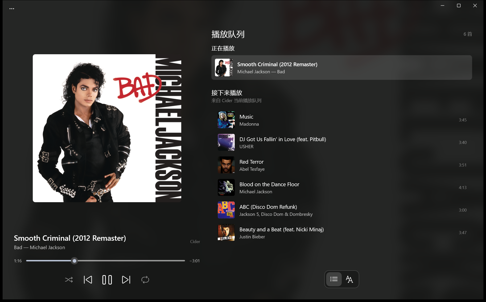
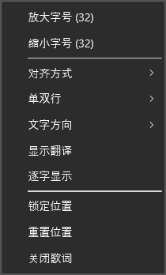
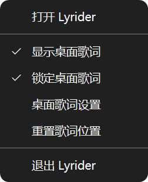
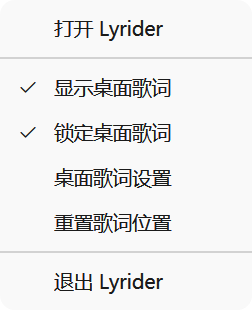

# Lyrider

**English** | [简体中文](README.zh.md)

Lyrider is a lyrics display companion for [Cider](https://cider.sh). **Windows 11 only.**

## Features

- A simple playback queue
- Lyrics and track information on the Windows taskbar
- Transparent desktop lyrics with translations, moving and resizing, click-through locking, and tray controls
- Low-latency lyric transitions driven by a locally synchronized playback clock
- Preferred lyrics source selection with automatic fallback across Cider, NetEase Cloud Music, QQ Music, Musixmatch, and LRCLIB
- The main window shows the source of the lyrics currently displayed
- Optional Simplified Chinese translations supplied by the selected lyrics source
- Simplified Chinese and English interfaces, following the Windows display language by default with a manual language option in Settings
- Experimental section in Settings: right-align the taskbar lyrics when the Windows taskbar keeps its icons on the left (lyrics flush right beside the artwork, artwork at the right edge)

## Preview

### Main window



### Taskbar widget

<p align="center">
  
  
</p>

### Desktop lyrics




### Tray menu

<p align="center">
  
  
</p>

## Installation

### Prepare Cider

Install and start [Cider](https://cider.sh), then enable the Local API in Cider's settings. Lyrider connects to `http://localhost:10767/` by default. If authentication is enabled for the Local API, enter the App Token generated by Cider during Lyrider's first-run setup or on its Settings page.

### Lyrics sources and translations

The default Automatic mode tries NetEase Cloud Music, QQ Music, Cider, Musixmatch, and LRCLIB in that order. Selecting a preferred source in Settings moves it to the front; if it has no suitable result, Lyrider continues with the other sources. Available Cider lyrics can appear while the search runs, and a better result replaces them without interrupting playback updates. The source name beside the track information follows the displayed result, including fallback and preloaded lyrics; it is hidden while loading a new track, when no lyrics are available, or when disconnected.

With translation enabled, Lyrider looks for time-synced lyrics with Chinese translations covering at least 80% of nonblank lines. Primarily Chinese lyrics do not need translations. If no result meets these conditions, Lyrider keeps the best available candidate. You can enable translation with Cider as the preferred source; other sources can supply the missing translation. Each remote lyrics source has a separate four-second timeout. Musixmatch is skipped unless you provide an API Key, which is encrypted locally with Windows DPAPI and never written to the regular settings file.

Translation displays only Simplified Chinese text supplied by the matched source; Lyrider does not machine-translate missing lines. When enabled, the main lyrics view shows the translation below each original line, and the taskbar shows the current original line above its translation. If the original lyrics are primarily Chinese or the current line has no translation, Lyrider keeps the current/next-line layout. Time-synced external lyrics are aligned to Cider timing when at least three unique lyric lines match. When Apple Music uses different titles or artist names across storefronts, Lyrider uses the Apple track ID to query Japanese-store metadata as an additional search alias. Without a track ID, a different title is accepted only when artist and duration identify one unique result, reducing false matches with other versions. NetEase Cloud Music and QQ Music rely on unofficial web endpoints and may stop working when those providers change them.

### Desktop lyrics

Enable desktop lyrics in Settings and save to show lyrics above ordinary app windows. Two-line lyrics and translation are enabled by default. For non-Chinese songs with a translation, the overlay shows the current original line and its translation, even in single-line mode. Otherwise, two-line mode shows the current and next lines, and single-line mode shows only the current line. Desktop translation is independent of the translation switch for the main window and taskbar. The overlay shows the song title while loading or when no synced lyrics are available, and hides when Cider disconnects or no track is active.

Choose horizontal or vertical text, with Center, Split, Left, or Right alignment. Split alignment places the two original lines at opposite sides; each line stays in its slot when it starts, and the finished slot receives the new upcoming line. Translation mode, single-line mode, and song titles use centered alignment when Split is selected. Lyrics stay vertically centered, with spacing adjusted to the window height. Existing layout preferences are preserved when upgrading.

The settings preview updates as you adjust the controls and can show ordinary lyrics or translations. Choose a color preset, or set sung and unsung colors separately. Both lines use the same font size; you can also set Normal, SemiBold, or Bold weight, outline color, and outline thickness from 0 to 8 DIP (0 disables the outline). In translation mode, both lines use the sung color. Otherwise, the current line uses the sung color and the next line uses the unsung color.

Enable Word-by-word display and save to sweep the current original line using real word timing supplied by Cider. The highlight freezes when paused. Lyrider prefers lyrics with word timing and can add matching translations from another source. Without valid word timing, the current line is highlighted as a whole; Lyrider does not estimate word progress. Translation mode uses the sung color for both lines without a word sweep.

The overlay starts unlocked. Drag it to move it; use the right, bottom, or bottom-right handles to resize it. Hovering shows previous, play/pause, next, lock, and close controls inside the window. Right-click unlocked lyrics to change font size, alignment, single/two-line mode, text direction, translation, or word-by-word display, or to lock, reset, or close the overlay. These shortcuts take effect immediately and are saved locally.

Locking hides the background and passes mouse input through to the app underneath. Hovering shows a clickable unlock icon. You can also uncheck Lock desktop lyrics in the tray menu to unlock it. The tray menu uses check marks for visibility and lock state, and provides settings and position reset actions. Font size, background opacity, and hiding while paused have separate settings. Position, size, and lock state are saved locally; resetting restores the default width and automatic content height. Desktop lyrics continue working when the main window is hidden and close when Lyrider exits.

Window size is limited to 320–1200 DIP wide and 80–480 DIP high; font size ranges from 16 to 72 DIP. The window fits within the current monitor work area, and its minimum height keeps the lyrics visible.

### Install Lyrider

1. Download `Lyrider_<version>_x64.msix` and `Lyrider.cer` from the same version on [GitHub Releases](https://github.com/Ayor1337/Lyrider/releases/latest).
2. For the first installation, open PowerShell in the download directory and run:

```powershell
Import-Certificate -FilePath .\Lyrider.cer -CertStoreLocation Cert:\CurrentUser\TrustedPeople
$package = Get-ChildItem -Filter 'Lyrider_*_x64.msix' |
    Sort-Object LastWriteTime -Descending |
    Select-Object -First 1
Add-AppxPackage $package.FullName
```

Alternatively, double-click `Lyrider.cer`, install it for the current user in the **Trusted People** certificate store, and then double-click the MSIX package. Only trust a certificate downloaded from this repository's Releases page.

The package includes the .NET and Windows App SDK runtimes, plus both interface languages in the main package so the Settings language selector works independently of the Windows display language. When future versions are signed with the same certificate, you can install the new MSIX directly without importing the certificate again.

## Running from source

Requirements:

- Windows 11 x64
- [.NET 10 SDK](https://dotnet.microsoft.com/download/dotnet/10.0)
- Git

Clone the repository and run the following commands from its root directory:

```powershell
git clone https://github.com/Ayor1337/Lyrider.git
cd Lyrider

dotnet restore .\Lyrider.sln -p:Platform=x64
dotnet build .\Lyrider.sln -p:Platform=x64 --no-restore
dotnet run --project .\src\Lyrider\Lyrider.csproj -p:Platform=x64
```

Run the tests with:

```powershell
dotnet test .\tests\Lyrider.Tests\Lyrider.Tests.csproj
```

The test project is intentionally not included in `Lyrider.sln`, so invoke it directly. Do not use `--no-build` unless you have just built the test project separately. Exit a running Debug build of Lyrider before rebuilding to avoid locking the executable.

## License

This project is licensed under the [MIT License](LICENSE).
