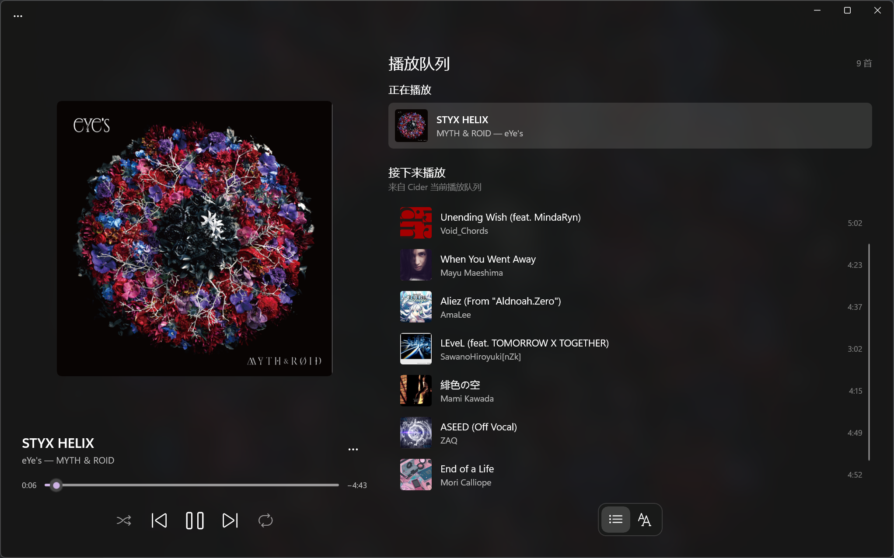
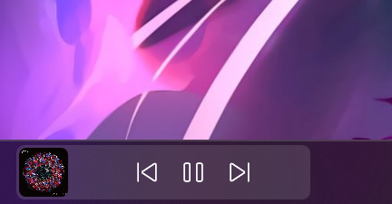

# Lyrider

**English** | [简体中文](README.zh.md)

Lyrider is a lyrics display companion for [Cider](https://cider.sh). **Windows 11 only.**

## Features

- A simple playback queue
- Lyrics and track information on the Windows taskbar
- Transparent desktop lyrics with translations, moving and resizing, click-through locking, and tray controls
- Low-latency lyric transitions driven by a locally synchronized playback clock
- Selectable Cider, NetEase Cloud Music, QQ Music, Musixmatch, and LRCLIB lyrics sources
- Optional Simplified Chinese translations supplied by the selected lyrics source
- Simplified Chinese and English interfaces, following the Windows display language by default with a manual language option in Settings
- Experimental section in Settings: right-align the taskbar lyrics when the Windows taskbar keeps its icons on the left (lyrics flush right beside the artwork, artwork at the right edge)

## Preview

### Main window



### Taskbar widget

<p align="center">
  
  
</p>

## Installation

### Prepare Cider

Install and start [Cider](https://cider.sh), then enable the Local API in Cider's settings. Lyrider connects to `http://localhost:10767/` by default. If authentication is enabled for the Local API, enter the App Token generated by Cider during Lyrider's first-run setup or on its Settings page.

### Lyrics sources and translations

The default **Automatic** mode tries Cider, NetEase Cloud Music, QQ Music, Musixmatch, and LRCLIB in that order. With translation disabled, it stops at the first confident match. With translation enabled, a source that supplies only original lyrics becomes a fallback while Lyrider continues looking for a source with translations; if none has a translation, the first original result is retained. You can instead lock Lyrider to one source in Settings; fixed sources do not fall back. Because Cider does not supply translations, selecting it as the fixed source turns off and disables the translation option. Musixmatch requires your own API Key; it is encrypted locally with Windows DPAPI and is never written to the regular settings file.

Translation displays only Simplified Chinese text supplied by the matched source; Lyrider does not machine-translate missing lines. When enabled, the main lyrics view shows the translation below each original line, and the taskbar shows the current original line above its translation. If the original lyrics are primarily Chinese or the current line has no translation, Lyrider keeps the current/next-line layout. Time-synced external lyrics are aligned to Cider timing when at least three unique lyric lines match. When Apple Music uses different titles or artist names across storefronts, Lyrider uses the Apple track ID to query Japanese-store metadata as an additional search alias. Without a track ID, a different title is accepted only when artist and duration identify one unique result, reducing false matches with other versions. NetEase Cloud Music and QQ Music rely on unofficial web endpoints and may stop working when those providers change them.

### Desktop lyrics

Enable desktop lyrics in Settings and save to show lyrics above ordinary app windows. “Two-line lyrics” and “Show desktop lyrics translation” are on by default, showing the current line and its translation, or the current and next lines when no translation is available. Turning translation off shows the current and next lines. Turning two-line lyrics off shows only the current line and keeps your translation preference. The overlay shows the song title while lyrics are loading or no synced lyrics are available, and hides when Cider disconnects or no track is active. Desktop lyrics requests translations when both switches are on; the existing translation switch still controls the main lyrics view and taskbar.

Choose Vertical or Top left / bottom right under Lyrics layout and save. Both layouts center the lyrics vertically in the window and adjust the gap between lines as the window height changes. The staggered layout uses inset padding, placing the first slot on the left and the second below on the right. Two original lines play alternately in these slots: each upcoming line stays in place when it starts, and the finished slot receives the new upcoming line. Highlighting and karaoke follow the active slot, including the final line. Single-line mode and song titles stay left-aligned and vertically centered in this layout. Translations remain below the current original line.

The overlay starts unlocked. Drag it to move it, or drag its right-hand handle to change the width, its bottom handle to change the height, or its bottom-right corner to change both. Locking makes the background transparent and passes mouse input through to the app underneath. Hovering shows only a clickable unlock icon; choose “Unlock desktop lyrics” from the tray menu to adjust it again. The tray also provides show/hide, settings, and position reset actions. Font size, text color, background opacity, and hiding while paused have separate settings. Position, width, height, and lock state are saved locally. Resetting the position restores the default width and automatic content height. The overlay continues working when the main window is hidden and closes when Lyrider exits.

Window size is limited to 320 to 1200 DIP wide and 80 to 480 DIP high; font size ranges from 16 to 72 DIP. The window also fits within the current monitor work area, and its minimum height keeps the lyrics visible.

Both lines use the same font size. The current line uses Current lyric highlight color, while translation or the next line uses Text color. With karaoke off or no word timing available, the whole current line is highlighted.

Enable “Karaoke mode” and save to highlight the current original line using word timing supplied by the lyric source. The highlight freezes when paused. You can choose a separate highlight color; translation and the next line keep their text color. Lyrider requests word timing from Cider and prefers lyrics that include it. Tracks without word timing highlight the whole current line with normal line sync, without estimated word progress. Word sync must be available for the track and its Cider lyric source.

### Install Lyrider

1. Download `Lyrider_<version>_x64.msix` and `Lyrider.cer` from the same version on [GitHub Releases](https://github.com/Ayor1337/Lyrider/releases/latest).
2. For the first installation, open PowerShell in the download directory and run:

```powershell
Import-Certificate -FilePath .\Lyrider.cer -CertStoreLocation Cert:\CurrentUser\TrustedPeople
$package = Get-ChildItem -Filter 'Lyrider_*_x64.msix' |
    Sort-Object LastWriteTime -Descending |
    Select-Object -First 1
Add-AppxPackage $package.FullName
```

Alternatively, double-click `Lyrider.cer`, install it for the current user in the **Trusted People** certificate store, and then double-click the MSIX package. Only trust a certificate downloaded from this repository's Releases page.

The package includes the .NET and Windows App SDK runtimes, plus both interface languages in the main package so the Settings language selector works independently of the Windows display language. When future versions are signed with the same certificate, you can install the new MSIX directly without importing the certificate again.

## Running from source

Requirements:

- Windows 11 x64
- [.NET 10 SDK](https://dotnet.microsoft.com/download/dotnet/10.0)
- Git

Clone the repository and run the following commands from its root directory:

```powershell
git clone https://github.com/Ayor1337/Lyrider.git
cd Lyrider

dotnet restore .\Lyrider.sln -p:Platform=x64
dotnet build .\Lyrider.sln -p:Platform=x64 --no-restore
dotnet run --project .\src\Lyrider\Lyrider.csproj -p:Platform=x64
```

Run the tests with:

```powershell
dotnet test .\tests\Lyrider.Tests\Lyrider.Tests.csproj
```

The test project is intentionally not included in `Lyrider.sln`, so invoke it directly. Do not use `--no-build` unless you have just built the test project separately. Exit a running Debug build of Lyrider before rebuilding to avoid locking the executable.

## License

This project is licensed under the [MIT License](LICENSE).
