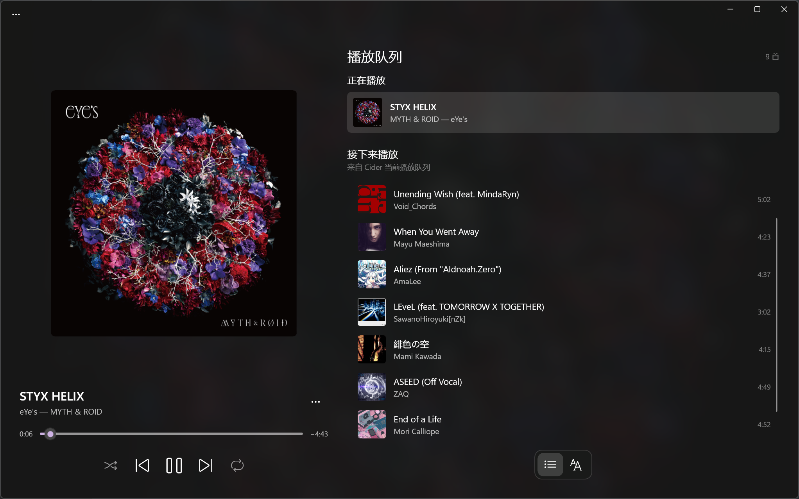

# Lyrider

[English](README.md) | **简体中文**

Lyrider 是一个用于 [Cider](https://cider.sh) 的歌词显示工具，**仅支持 Windows 11 平台**。

## 当前功能

- 一个简易的播放列表
- 在任务栏显示歌词和歌曲信息
- 可选择 Cider、网易云音乐、QQ 音乐、Musixmatch 和 LRCLIB 歌词源
- 可显示歌词源提供的简体中文译文
- 界面支持简体中文和英语，默认跟随 Windows 显示语言，也可在设置中切换

## 界面预览

### 主界面



### 任务栏组件

<p align="center">
  
  
</p>

## 运行方式

### 准备 Cider

安装并启动 [Cider](https://cider.sh)，然后在 Cider 设置中启用 Local API。Lyrider 默认连接 `http://localhost:10767/`；如果 Local API 开启了认证，还需要在 Lyrider 首次启动引导或设置页中填写 Cider 生成的 App Token。

### 歌词源与翻译

默认的“自动”模式会依次尝试 Cider、网易云音乐、QQ 音乐、Musixmatch 和 LRCLIB。未开启翻译时会在第一个可靠匹配处停止；开启翻译后，如果 Cider 或某个来源只有原文，会继续查找带译文的来源，最终仍找不到译文时保留最先命中的原文。也可以在设置中固定使用某个歌词源，固定来源不会回退。Musixmatch 需要填写自己的 API Key；它会使用 Windows DPAPI 加密保存在本机，不会写入普通设置文件。

翻译功能只显示歌词源自带的简体中文译文，不会对缺失内容进行机器翻译。开启后，主歌词页会在每句原文下方显示译文；任务栏会在当前原文下方显示译文。对于 Apple Music 在不同商店使用不同标题或歌手名的曲目，Lyrider 会使用曲目 ID 查询 Apple 日本商店元数据作为额外搜索别名；没有曲目 ID 时，只会在歌手和时长唯一对应时接受不同标题，避免误取同歌手的其他版本。网易云音乐与 QQ 音乐依赖非官方 Web 接口，提供方变更接口后可能暂时失效。

### 安装 Lyrider

1. 从 [GitHub Releases](https://github.com/Ayor1337/Lyrider/releases/latest) 下载同一版本的 `Lyrider_<版本>_x64.msix` 和 `Lyrider.cer`。
2. 首次安装时，打开 PowerShell，进入下载目录并执行：

```powershell
Import-Certificate -FilePath .\Lyrider.cer -CertStoreLocation Cert:\CurrentUser\TrustedPeople
$package = Get-ChildItem -Filter 'Lyrider_*_x64.msix' |
    Sort-Object LastWriteTime -Descending |
    Select-Object -First 1
Add-AppxPackage $package.FullName
```

也可以双击 `Lyrider.cer`，将证书安装到“当前用户”的“受信任人”存储，然后双击 MSIX 安装。只应信任从本仓库 Release 下载的证书。

安装包已包含 .NET、Windows App SDK 运行时和两套界面语言资源；语言资源会保留在主包中，因此设置页的语言选择不受 Windows 当前显示语言限制。后续版本只要继续使用同一张证书签名，直接安装新的 MSIX 即可升级，不需要重复导入证书。

## 通过源码运行

需要准备：

- Windows 11 x64
- [.NET 10 SDK](https://dotnet.microsoft.com/download/dotnet/10.0)
- Git

克隆仓库并在仓库根目录执行：

```powershell
git clone https://github.com/Ayor1337/Lyrider.git
cd Lyrider

dotnet restore .\Lyrider.sln -p:Platform=x64
dotnet build .\Lyrider.sln -p:Platform=x64 --no-restore
dotnet run --project .\src\Lyrider\Lyrider.csproj -p:Platform=x64
```

运行测试：

```powershell
dotnet test .\tests\Lyrider.Tests\Lyrider.Tests.csproj
```

测试项目没有加入 `Lyrider.sln`，因此必须直接指定测试项目；除非刚刚单独构建过该项目，否则不要使用 `--no-build`。重新构建 Debug 版本前请先退出正在运行的 Lyrider，避免可执行文件被占用。

## 开源协议

本项目基于 [MIT License](LICENSE) 开源。
